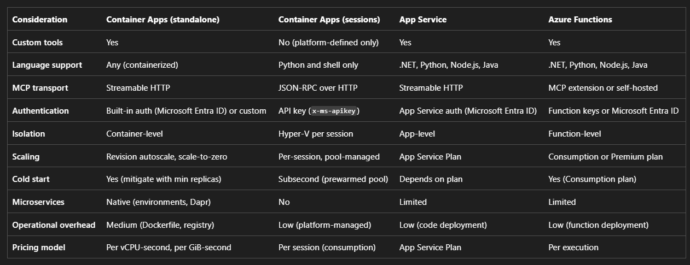

# MCP Hosting Options on Azure

Azure provides four ways to host an MCP server. Each option targets a different mix of flexibility, simplicity, and isolation.

## Azure Container Apps (standalone)

Deploy any MCP server you build as a container with HTTP ingress. Container Apps gives you full control over the runtime, supports any language with an MCP SDK, and includes features like autoscaling with scale-to-zero, Dapr integration, and service-to-service networking.

## Azure Container Apps dynamic sessions

Use platform-managed session pools with built-in MCP tooling for sandboxed code execution. You don't write or deploy MCP server code. The platform provides predefined tools for Python and shell environments, with Hyper-V isolation between sessions.

## Azure App Service

Add an MCP endpoint to an existing or new web app. App Service supports code-based deployment without a Dockerfile and integrates with Microsoft Entra ID for authentication.

## Azure Functions

Map function triggers to MCP tools by using the Azure Functions MCP extension. Azure Functions is optimized for stateless, event-driven tool execution with per-invocation pricing.

## Comparing Hosting Options

## Recommended: Azure Container Apps (standalone) or Azure App Service

Both services let you build an MCP server with any official MCP SDK and expose it over streamable HTTP. Choose between them based on your deployment model and feature needs.

- Container Apps: Prefer containers, need autoscaling with scale-to-zero, want Dapr integration, or are building a microservices architecture with multiple MCP servers. For interactive MCP clients (like GitHub Copilot), set a minimum replica count of 1 to avoid cold-start latency.

- App Service: Prefer code-based deployment without a Dockerfile, have an existing App Service Plan, or want the simplicity of az webapp up.

## Tutorials

https://learn.microsoft.com/en-us/azure/container-apps/tutorial-mcp-server-python

https://learn.microsoft.com/en-us/azure/container-apps/tutorial-mcp-server-nodejs